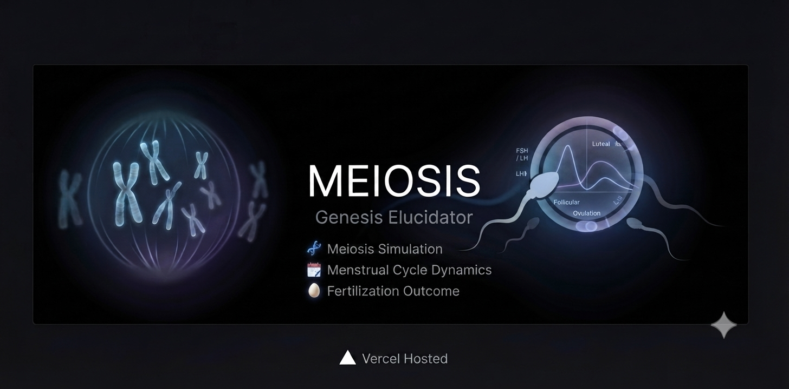

  

# 🧬 Genesis:Elucidator

**Interactive Meiotic Division Simulator**

---

### 📖 Overview
**Cellula-Kinetics** is an interactive educational tool designed to visualize the complex stages of meiotic cell division. It transforms abstract biological processes into a guided, browser-based simulation, making chromosome behavior and genetic recombination intuitive for students and educators.

### ✨ Core Features
* **Interactive Stages**: Step-by-step visualization of Meiosis I and II.
* **Chromosome Dynamics**: Real-time modeling of homologous pairing, crossing over, and segregation.
* **Educational Workflow**: Guided interface designed for clarity and scientific accuracy.
* **Responsive Design**: Optimized for seamless use across desktop and mobile browsers.

---

### 🤝 Credits
* **Replit**: Environment for application development and code construction.
* **GitHub**: Version control and repository management.
* **Vercel**: Deployment and cloud hosting.
* **OpenAI**: Scientific debugging, testing, and optimization.

---

### 📜 License
GPL-3.0

### 👨‍🏫 Author
**Draven-Ashcroft** | DIPS Chain of Institutions, Tanda
